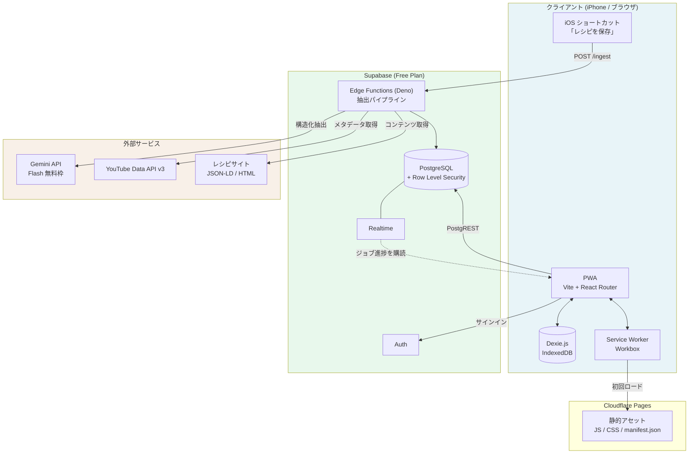
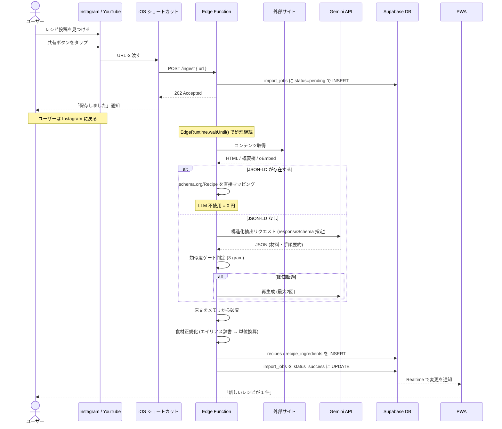
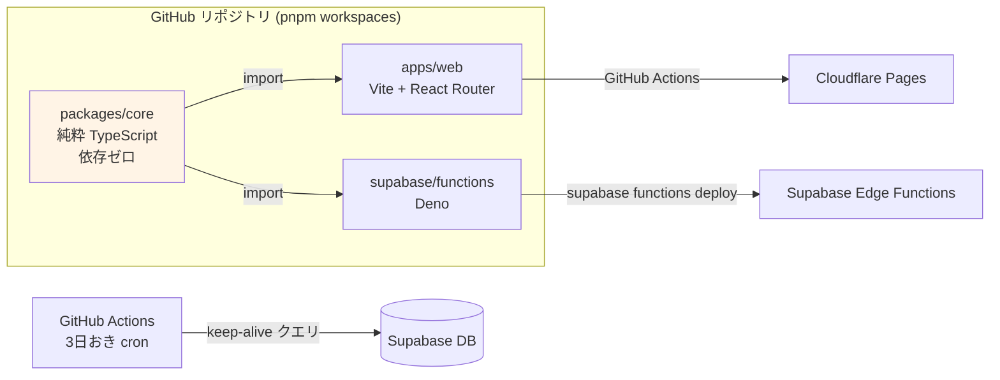
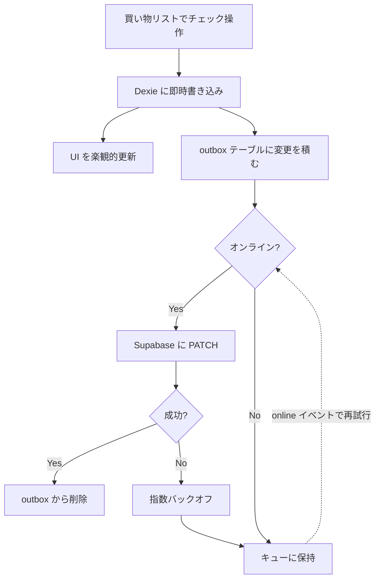
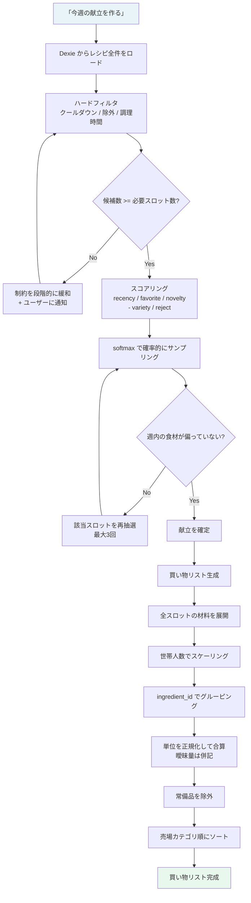
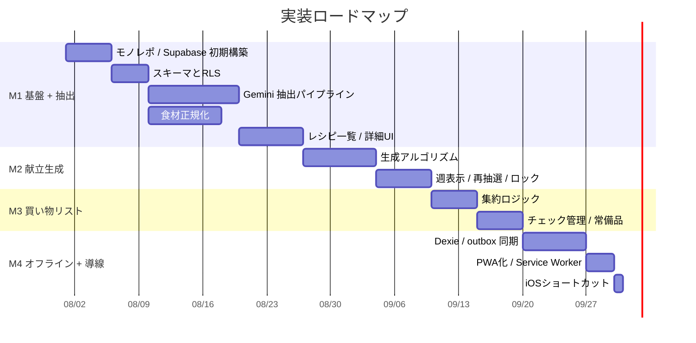
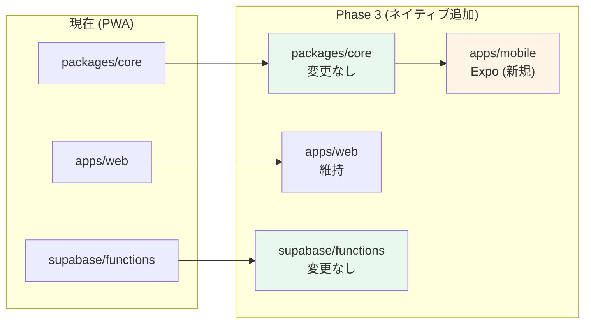

# アーキテクチャ設計書 v0.1

> 対象: 週間献立プランナー
> 作成日: 2026-07-28
> 関連: `weekly-menu-planner-spec.md` (v0.3) / `tech-stack-cost-analysis.md` (v0.1)

---

## 1. 確定した技術選定

| レイヤ | 採用 | 決定理由 |
|---|---|---|
| 配信形態 | **PWA（ホーム画面追加）** | Apple Developer Program の年会費 15,000 円を回避。継続利用が実証されてからネイティブ移植を判断する |
| フロント | **Vite + React Router** | SSR 不要・オフライン前提の SPA。Next.js は過剰 |
| ローカル DB | **Dexie.js（IndexedDB）** | 買い物リストのオフライン動作が必須要件 |
| BaaS | **Supabase Free** | Postgres + Auth + Edge Functions + Realtime。無料枠に対し想定利用量が桁違いに小さい |
| LLM | **Gemini Flash（無料枠）** | 月 20〜50 件の抽出に対し日次上限 1,000 件超。プロバイダ抽象化により後から切替可能 |
| ローカル LLM | **不採用** | 常時稼働の電気代（月 約 223 円）がクラウド API 料金を上回るため |
| 取り込み導線 | **iOS ショートカット → Edge Function** | Share Extension の代替。App Groups entitlement が不要になり年会費回避と両立する |
| 静的配信 | **Cloudflare Pages** | 帯域無制限の無料枠 |

**月額ランニングコスト: 0 円**

---

## 2. システム全体構成



### 責務の分担

| コンポーネント | 責務 | 実行場所 |
|---|---|---|
| iOS ショートカット | URL を共有シートから受け取り POST するだけ | 端末 |
| Edge Function | コンテンツ取得・AI 抽出・類似度判定・食材正規化 | Supabase (Deno) |
| PWA | 献立生成・買い物リスト集約・全 UI | ブラウザ |
| PostgreSQL | 永続化・RLS による認可 | Supabase |
| Dexie | オフライン読み書きと同期キュー | ブラウザ |

**献立生成と買い物リスト集約はクライアント側で完結させる。** サーバーラウンドトリップが不要になり、レスポンス 1 秒以内という非機能要件を素直に満たせる。データ量は 1 ユーザーあたりレシピ 1,000 件程度なので、ブラウザ上での処理に何ら問題はない。

---

## 3. レシピ取り込みフロー



### 3.1 非同期化が必須である理由

抽出は 5〜15 秒かかる。ショートカットが完了を待つと、ユーザーは Instagram の画面で固まったまま待たされる。

そこで **Edge Function は即座に 202 を返し、`EdgeRuntime.waitUntil()` で処理を継続する。** これにより体感は「共有 → 即完了」になる。処理結果は Realtime 経由で PWA に届き、次にアプリを開いたときに反映されている。

**フォールバック**: `waitUntil` の途中で実行環境が落ちた場合に備え、`import_jobs` が 10 分以上 `pending` のままなら再実行する `pg_cron` ジョブを置く。

### 3.2 ショートカットの認証設計

ショートカットには Supabase の JWT を持たせられない（有効期限が切れる）。専用のトークンを発行する。

```sql
create table ingest_tokens (
  id uuid primary key default gen_random_uuid(),
  user_id uuid not null references auth.users(id),
  token_hash text not null unique,          -- 生トークンは保存しない
  label text,                                -- 'Yutaro の iPhone'
  last_used_at timestamptz,
  revoked_at timestamptz,
  created_at timestamptz default now()
);
```

- 設定画面でトークンを生成し、その場で 1 回だけ平文を表示してショートカットに貼り付ける
- Edge Function は `Authorization: Bearer <token>` を受け取り、ハッシュ照合で `user_id` を解決する
- **レート制限を必ず入れる**（1 トークンあたり 60 件/時）。トークンが漏れた場合に Gemini の無料枠を食い潰されるのを防ぐ
- 端末紛失時は `revoked_at` を立てて失効させる

---

## 4. モノレポ構成とデプロイ



### 4.1 ディレクトリ構成

```
recipe-planner/
├── packages/
│   └── core/                    # 純粋 TypeScript。React も Deno API も使わない
│       ├── generation/          # 献立生成アルゴリズム        → ブラウザで実行
│       ├── shopping/            # 買い物リスト集約・単位換算   → ブラウザで実行
│       ├── normalize/           # 食材名の正規化・エイリアス辞書 → Deno で実行
│       ├── similarity/          # 3-gram 類似度計算           → Deno で実行
│       └── types/               # 共有型定義
├── apps/
│   └── web/
│       ├── src/
│       │   ├── routes/          # React Router のルート定義
│       │   ├── db/              # Dexie スキーマと同期ロジック
│       │   ├── components/
│       │   └── lib/supabase.ts
│       ├── public/manifest.json
│       └── vite.config.ts       # vite-plugin-pwa
├── supabase/
│   ├── migrations/
│   └── functions/
│       ├── ingest/              # POST /ingest
│       └── _shared/
│           └── providers/       # ExtractionProvider 実装
└── .github/workflows/
    ├── deploy-web.yml
    ├── deploy-functions.yml
    └── keep-alive.yml
```

### 4.2 注意点：`packages/core` は Deno とブラウザの両方から読まれる

これが本構成で唯一の技術的な摩擦点になる。守るべき制約は 3 つ。

1. **npm 依存をゼロにする。** Deno から npm パッケージを引くと import map の管理が煩雑になる
2. **Node 組み込みモジュールを使わない**（`fs`、`path`、`crypto` など）
3. **拡張子付きの相対 import を書く**（`./foo.ts`）。Deno は拡張子を省略できない

この制約は結果的にドメインロジックを純粋に保つ強制力になり、ユニットテストも書きやすくなる。SDD の観点でもむしろ望ましい。

### 4.3 Supabase の一時停止対策

無料枠は 7 日間 DB アクセスがないとプロジェクトが自動停止する。毎週使うアプリなので通常は問題にならないが、旅行などに備えて GitHub Actions で 3 日おきに軽いクエリを投げる（無料枠内）。

---

## 5. オフライン戦略

買い物リストは店内で使う。電波が弱い環境でも完全に動作する必要がある。



### 5.1 Outbox パターン

```typescript
// Dexie スキーマ
db.version(1).stores({
  recipes:       'id, source_id, *dish_roles, last_cooked_at',
  ingredients:   'id, canonical_name, category',
  mealPlans:     'id, start_date',
  shoppingItems: 'id, shopping_list_id, category, is_checked',
  outbox:        '++seq, table_name, record_id, created_at',
});
```

- **読み取り**: 常に Dexie から。UI がネットワークを待つことはない
- **書き込み**: Dexie に書いた上で `outbox` に積む。UI は即座に反映される
- **同期**: `navigator.onLine` と `online` イベントを契機に outbox をフラッシュ
- **競合解決**: `updated_at` による Last-Write-Wins。世帯内 2 人の利用では実質的に競合しない

### 5.2 Service Worker のキャッシュ戦略

`vite-plugin-pwa`（Workbox）で構成する。

| リソース | 戦略 |
|---|---|
| アプリシェル（JS / CSS / HTML） | Precache |
| Supabase API レスポンス | キャッシュしない（Dexie が担うため） |
| 外部サムネイル画像 | StaleWhileRevalidate（30 日） |
| YouTube 埋め込み | キャッシュしない |

---

## 6. 献立生成と買い物リストのフロー



**この一連の処理はすべてブラウザ内で完結する。** ネットワークアクセスもサーバー処理も発生しないため、オフラインでも献立を作り直せる。

---

## 7. セキュリティ

| 項目 | 方針 |
|---|---|
| **Gemini API キー** | Edge Function の環境変数にのみ格納。**PWA のバンドルには絶対に含めない**（クライアントの JS は誰でも読める） |
| YouTube API キー | 同上 |
| Supabase anon key | クライアント露出は想定内。RLS で防御する |
| RLS | 全テーブルで `user_id = auth.uid()`。子テーブルは親経由で判定 |
| ingest トークン | ハッシュ化して保存。レート制限とリボーク機能を必須実装 |
| 抽出対象 URL | SSRF 対策として、内部アドレス（`localhost` / `169.254.*` / プライベート IP）への fetch を拒否 |

---

## 8. 実装順序



### 優先順位の考え方

**M1 の抽出パイプラインに最も時間を割く。** 仕様書で繰り返し述べた通り、材料の取りこぼしは買い物リストの破綻に直結し、プロダクト全体の価値を決める。ここで手を抜くと後工程がすべて無意味になる。

逆に PWA 化とショートカットは最後で構わない。開発中はブラウザで動かせばよく、PWA 化は `vite-plugin-pwa` を入れるだけ、ショートカットは GUI 操作で完結する。**合計 4 日程度**しかかからない。

---

## 9. 検証すべき仮説（M1 完了時点）

実装を進める前に、以下は早い段階で実データを取って確かめる。

| # | 仮説 | 検証方法 | 失敗時の対応 |
|---|---|---|---|
| 1 | Gemini Flash で日本語レシピの材料を実用精度で抽出できる | リュウジ氏の動画 10 本 + Web レシピ 10 件で材料の取りこぼし率を測定 | Claude Haiku 4.5 に切替（月 70 円） |
| 2 | 手順要約が原文と十分に離れる | 類似度スコアの分布を確認 | プロンプト調整。それでも駄目なら要約を捨てて埋め込みのみに |
| 3 | 食材の表記ゆれを吸収できる | 30 レシピ分の材料を正規化し、重複が残らないか目視確認 | エイリアス辞書を手動で拡充 |
| 4 | 副菜レシピが十分に集まる | 収集した 30 件の dish_roles 分布を確認 | 汎用副菜プリセットを同梱（仕様書 未決事項 #4） |
| 5 | Instagram のキャプションが取得できる | 実際に 5 件試す | スクショ OCR 経路に切替 |

**仮説 1 と 4 は M1 の途中でも判定できる。** 早めに 20〜30 件を実際に取り込んで、数字を見てから残りを作るのが安全。

---

## 10. 将来のネイティブ移植（Phase 3）

半年使い続けて価値が実証された場合の移植パス。



書き直すのは UI 層のみ。`packages/core` と Edge Functions はそのまま流用できる。この構成を最初から取っておくことが、移植コストを「UI の再実装だけ」に抑える条件になる。

移植時に追加で必要になるもの:
- Apple Developer Program（年 15,000 円）
- `expo-share-extension` の Config Plugin 導入
- EAS Dev Client によるビルド環境（無料枠で iOS 15 ビルド/月）